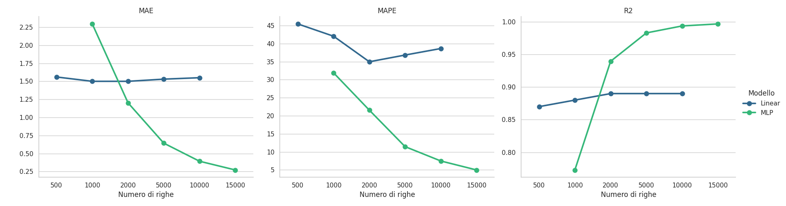
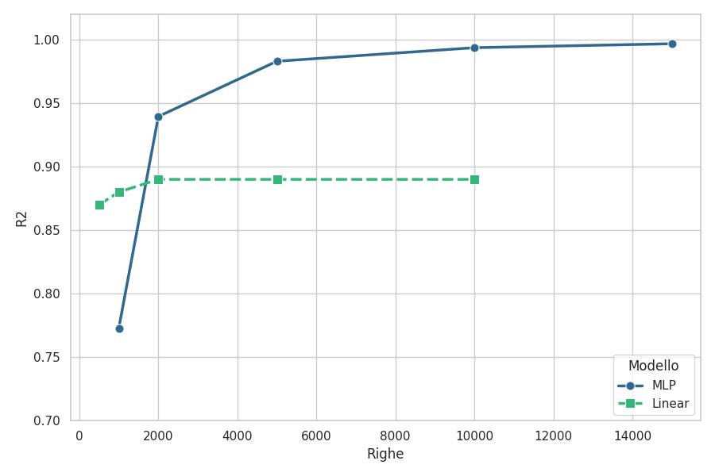
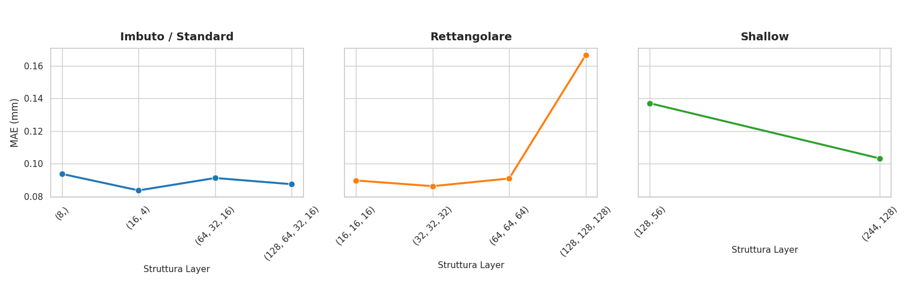
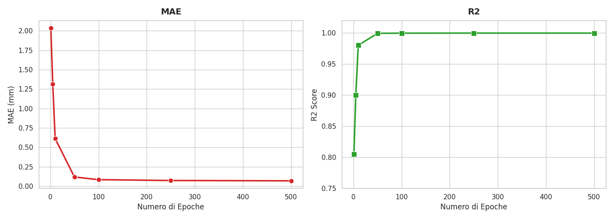
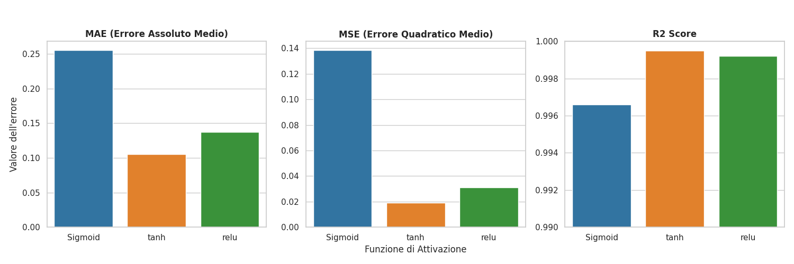



# Introduzione 

Nell'ambito dell'informatica, la risoluzione di un problema tramite programmazione avviene solitamente attraverso lo sviluppo di un algoritmo dedicato. Tuttavia, in situazioni più complesse dove la creazione di un algoritmo diventa impraticabile, è necessario adottare un approccio differente.  
L'introduzione delle reti neurali ha rappresentato una svolta, permettendo di affrontare e risolvere proprio quei problemi per i quali lo sviluppo di un algoritmo tradizionale non è fattibile.

L'obiettivo di questo progetto è creare, addestrare e analizzare le prestazioni di una rete neurale sviluppata su misura per risolvere un problema di regressione applicato alla piegatura in aria. 
Nello specifico, il modello mira a prevedere la corsa del punzone necessaria per ottenere l'angolo di piega desiderato, partendo dalle proprietà meccaniche del materiale e dalle caratteristiche geometriche della macchina e degli utensili.

## Piegatura in aria

La piegatura in aria è uno dei metodi di lavorazione della lamiera più diffusi e impiegati nel campo della produzione industriale moderna. Questa tecnica si distingue per la sua flessibilità e per il ridotto costo di attrezzaggio, fattori che la rendono la migliore scelta per la realizzazione di una vasta gamma di componenti.

{width=80%}

### Principi di Funzionamento

A differenza della coniatura o della piegatura a fondo cava, dove il punzone preme il metallo fino a farlo aderire completamente alla matrice, nella piegatura in aria il foglio di lamiera è supportato solo sui due spigoli superiori della matrice a "V". La piega viene ottenuta applicando una forza con un punzone, il cui apice spinge il centro della lamiera verso l'apertura della matrice, senza tuttavia raggiungere il fondo. Il raggio interno finale della piega non è determinato dalla forma della matrice (come avviene nella coniatura), ma dalla pressione applicata e dalle proprietà del materiale.

Vantaggi Chiave:

1. Flessibilità, un singolo set di punzoni e matrici può essere utilizzato per ottenere un'ampia varietà di angoli di piegatura ,da circa 30° a 180°, semplicemente variando la profondità di penetrazione del punzone.  
2. Costo Ridotto, richiede un minor numero di attrezzature specifiche e non necessita di forze di pressatura estreme, il che riduce l'usura degli strumenti e il consumo energetico.  
3. Velocità di Set-up, il cambio di produzione per realizzare pezzi con angoli diversi è rapido, migliorando l'efficienza complessiva.

Nonostante la sua popolarità, la piegatura in aria richiede una gestione precisa dell'effetto del ritorno elastico, un fenomeno che deve essere compensato con una sovra-piegatura calibrata per garantire la precisione dimensionale del prodotto finito.

# Dataset

Il dataset è composto da dati tabellari dettagliati, risultanti da una serie di prove di piegatura condotte in un ambiente simulato, e quindi generate sinteticamente. Questi dati coprono una vasta gamma di scenari, includendo la variazione di diversi materiali (come acciai e alluminio) e l'utilizzo di diverse macchine piegatrici.

**Livello di Ingresso (Input Layer)**

Per formalizzare questo problema di regressione, i nodi del primo strato della rete sono stati strutturati per accogliere sette parametri numerici fondamentali. Per una migliore comprensione del processo, i seguenti sono parametri di input (o *features*):

* Modulo di Young (MPa)
* Carico di Snervamento (MPa)
* Spessore del materiale (mm)
* Apertura Cava a "V" (mm)
* Raggio del Punzone (mm)
* Raggio della Matrice (mm)
* Angolo di Piegatura Desiderato (gradi)

**Livello di Uscita (Output Layer)** 

A fronte dell'elaborazione di queste sette variabili in ingresso, l'architettura della rete converge verso un singolo nodo nel livello finale. Questo nodo fornisce un unico valore continuo che rappresenta la variabile dipendente che il modello mira a prevedere:

* Corsa del Punzone (mm)

## Normalizzazione del Dataset

Per garantire buone prestazioni della rete, è necessario normalizzare il dataset prima di utilizzarlo. I dati di input (*features*) ,forniti al modello, hanno scale di grandezza e unità di misura diverse.

Se questi dati venissero forniti al modello nella loro forma grezza, la rete neurale tenderebbe a dare un peso irrealisticamente maggiore alle variabili con i numeri più grandi, compromettendo la fase di addestramento e l'accuratezza finale.

Per ovviare a questo problema, la normalizzazione avviene all'interno della funzione che carica il dataset, tramite l'utilizzo del comando **fit_transform()**. Questo comando, in sintesi, opera su ogni colonna del dataset calcolando la media, sottraendola a ciascun valore e dividendo il risultato per la deviazione standard. Matematicamente, applica la seguente formula di standardizzazione ad ogni singolo dato $x$:

$$
z = \frac{x - \mu}{\sigma}
$$

In questo modo, tutte le features vengono compresse in una scala adimensionale e uniforme (con media zero e deviazione standard pari a uno), permettendo alla rete di valutare l'importanza reale di ogni parametro fisico senza essere influenzata dall'unità di misura originale.

# Modelli per la regressione

All'interno della libreria Scikit-learn (SKLearn) sono disponibili diversi metodi per la regressione, tra cui la classica regressione lineare, gli alberi decisionali (Decision Tree) e regressori basati su reti neurali come *MLPRegressor*.

È possibile utilizzare *MLPRegressor* con i parametri predefiniti per analizzare le sue prestazioni nel problema in esame. Per avere un termine di paragone, i risultati ottenuti con la regressione MLP possono essere confrontati con quelli della regressione lineare.

Questo approccio permette di valutare l'impatto della dimensione del dataset sulle predizioni e sull'accuratezza del modello.

{fig-align="left" width=110%}

L'analisi grafica mostra chiaramente che, nel caso del modello *MLPRegressor*, l'aumento della dimensione del dataset porta a una diminuzione dell'errore assoluto medio (MAE) e dell'errore quadratico medio (MSE), con il conseguente aumento del coefficiente R2.  

{width=60%}

con un dataset di grandi dimensioni tuttavia, si osserva che il modello MLP rischia quindi di incorrere nell'overfitting. Questo rappresenta un problema, poiché il modello diventa troppo specifico per il dataset di addestramento e meno generalizzabile al problema che si intende risolvere, risultando in una bassa accuratezza complessiva al di fuori del dataset di addestramento.

# Modelli custom

La creazione di una rete neurale su misura è, quando si affrontano casi più complicati, necessaria per la risoluzione del problema, poiché i modelli standard non sempre riescono ad avere le prestazioni desiderate.

Partendo dai layer di ingresso e di uscita, in entrata ci sono le features che rappresentano i parametri considerati per la predizione nel caso della specifica applicazione ci sono 7 layer in ingresso mentre i layer in uscita rappresentano il risultato ottenuto dalla rete che nel caso specifico è solo uno.

Vengono chiamati layer nascosti i layer che collegano le features e l’uscita della rete, la larghezza e profondità di questi layer e come sono collegati è come la rete riesce ad arrivare ad un risultato.  
Il numero di strati nascosti definisce la capacità del modello di astrarre e comprendere relazioni non lineari sempre più articolate.

Come ne è stato parlato in precendenza la scelta della dimensione del modello è molto importante per evitare di cadere nel caso dell’underfitting o dell’overfitting.

## Configurazione 

La configurazione consiste nella dimensione e il numero di layer nascosti all’interno della rete, questi sono parametri fondamentali essendo che configurazioni diverse sono propense ad applicazioni differenti, quindi fare la scelta giusta diventa fondamentale per ottenere le migliori prestazioni dalla rete.

### Configurazioni a Imbuto (Funnel)

Questa configurazione classica prevede che il numero di layer nascosti diminuisca progressivamente fino ad avvicinarsi al numero di layer di output.  
Costringere la rete a distillare le informazioni, scartando i dati superflui.

Configurazioni per Test:

* 8
* 16 $\rightarrow$ 4
* 64 $\rightarrow$ 32 $\rightarrow$ 16
* 128 $\rightarrow$ 64 $\rightarrow$ 32 $\rightarrow$ 16

### Configurazioni Rettangolari (Rectangular)

Queste architetture mantengono un numero costante di neuroni in tutti i layer nascosti.  
Permettere alla rete di modellare operazioni matematiche anche complesse e comportamenti non lineari, rendendole ottimali per simulazioni fisiche.

Configurazioni per Test:

* 16 $\rightarrow$ 16 $\rightarrow$ 16
* 32 $\rightarrow$ 32 $\rightarrow$ 32
* 64 $\rightarrow$ 64 $\rightarrow$ 64
* 128 $\rightarrow$ 128 $\rightarrow$ 128

### Configurazioni Piatte (Shallow)

Si tratta di reti con pochi (tipicamente due) layer nascosti ma con un'ampia larghezza.

Configurazioni per Test:

* 128 $\rightarrow$ 56
* 244 $\rightarrow$ 128

{fig-align="left" width=110%}

Per il tipo di applicazione in esame, una configurazione rettangolare sembrerebbe la più appropriata. Tuttavia, come evidenziato dai grafici, anche la struttura a imbuto dimostra un errore medio che, in alcuni casi, risulta persino migliore rispetto a quello della configurazione rettangolare.

La configurazione ottimale si è rivelata essere la struttura a imbuto con layer nascosti di larghezza 16 e 4. Questo risultato è abbastanza prevedibile, considerando la semplicità del problema anche una rete neurale di dimensioni ridotte è in grado di estrarre tutte le informazioni necessarie per effettuare una predizione accurata.

## Epoche

Un'epoca, nella fase di training di una rete neurale, rappresenta un completo ciclo di addestramento.  
Durante un’epoca l’intero dataset di training viene elaborato propagandosi all’interno della rete e vengono aggiornati i pesi per minimizzare l’errore.  
Poichè le reti neurali opprendono in modo graduale le epoche permettono di riesaminare i dati e correggere i pesi di conseguenza.

La scelta del numero di epoche è comunque una scelta critica essendo che fare traning con un numero di epoche troppo basse porta il modello a fare underfitting, al contrario se si usa un numero troppo grande di epoche si ha la situazione inversa cioè l’overfitting.

Mettendo in grafico l’errore medio ottenuto dalla predizione e il punteggio R2 contro il numero di epoche usate durante la fase di training, si ottiene un grafico del genere:  

da cui si vede come fino alle 50 epoche si ha un miglioramento deciso della predizione per poi divenire stagnante dalle successive, questo perché non essendo un problema particolarmente complesso 50 epoche sono più che sufficienti per minimizzare l’errore.  
In questo caso aumentare il numero di epoche oltre le 50 non è produttivo perché è un costo computazionale sprecato e si hanno tutti i deficit dell’overfitting.

## Funzione di attivazione 

La funzione di attivazione è la componente della rete che decide come le informazioni vengono trasmesse attraverso di essa.

Un neurone prende come ingresso la somma pesata degli ingressi e calcola il segnale di output in base al tipo di funzione di attivazione scelta, solitamente le funzioni di attivazioni non sono lineari questo per permettere alla rete di apprendere concetti più complessi.

Le funzioni di attivazione più usate sono le seguenti:

* Sigmoid
* Tanh
* ReLU

queste sono le funzioni che verranno usate per studiare la rete presa in esempio.

Osservando i grafici relativi all'Errore Assoluto Medio (MAE), all'Errore Quadratico Medio (MSE) e all'indice $R^2$, emerge una chiara gerarchia prestazionale tra le funzioni testate. 

La funzione *Sigmoid* registra le performance peggiori.

La *ReLU*, pur essendo uno standard industriale, ottiene risultati sub-ottimali in questo specifico scenario. A causa del suo comportamento a soglia, che annulla ogni valore negativo in ingresso, tende a sopprimere l'attivazione di alcuni neuroni sui dati standardizzati, perdendo frazioni di informazione utili per il calcolo di precisione.

La funzione *Tanh* si dimostra al contrario la scelta nettamente superiore per questo problema di regressione. La sua natura simmetrica e non lineare permette di propagare il segnale senza distorsioni di scala, modellando con estrema accuratezza e continuità il comportamento fisico e le curvature della deformazione plastica della lamiera.

# Conclusione

L'obiettivo di questo progetto era quello di sviluppare e analizzare una rete neurale in grado di prevedere con precisione la corsa del punzone nella piegatura in aria, superando i limiti degli algoritmi tradizionali. L'analisi condotta ha dimostrato che le reti neurali rappresentano uno strumento estremamente efficace per modellare le dinamiche non lineari di questo processo industriale, ma solo se accuratamente dimensionate.

Lo studio dei modelli di baseline ha evidenziato come architetture generiche rischino di incorrere in fenomeni di overfitting all'aumentare dei dati. Al contrario, la progettazione di un modello custom ha permesso di individuare un "punto di ottimo" inestricabilmente legato alla fisica del problema la configurazione a imbuto (16, 4) si è rivelata l'architettura migliore. La sua struttura compatta si è dimostrata sufficientemente espressiva per estrarre le informazioni necessarie dalle features in ingresso, mantenendo al contempo un'elevata capacità di generalizzazione.

L'analisi della convergenza ha confermato questo comportamento del modello: la rete raggiunge prestazioni ottimali in appena 50 epoche di addestramento, oltre le quali il miglioramento diviene stagnante, rendendo ulteriori cicli computazionalmente inefficienti e improduttivi. Infine, l'ottimizzazione degli iperparametri ha rivelato che la funzione di attivazione *Tanh* riesce a modellare le relazioni matematiche di questo specifico dominio con un'accuratezza superiore rispetto alle alternative come Sigmoid o ReLU, permettendo di minimizzare l'errore assoluto medio.

